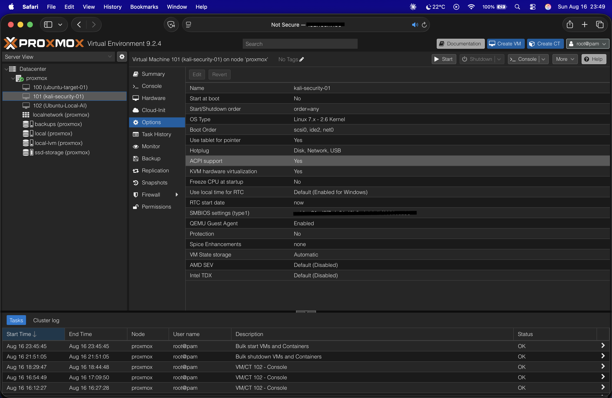

# 🔐 Security Learning Log

Ongoing, self-directed security learning — HTB Academy and TryHackMe, with real notes on what actually sank in from each module.

Not a certification. Not a claim of expertise. Just a running record of what I've worked through, so it doesn't disappear the way my earlier HTB/THM progress did before I started writing it down.

---

## 📊 Where I'm at

**26 modules/rooms completed** across HTB Academy and TryHackMe, spanning:

- **Fundamentals:** Linux, networking, web requests, subnetting
- **Web security:** SQL injection, JavaScript deobfuscation
- **Identity & access:** IAAA model, SSO, SAML, OAuth 2.0
- **Blue team:** phishing/email header analysis, defensive security, SOC basics
- **Red team:** pentesting methodology, Metasploit, threat intel
- **DevSecOps:** CI/CD pipeline security basics

📄 **[Full module-by-module log →](./PROGRESS.md)**

---

## 🧩 Why this exists

I connected this to my own homelab whenever I could — network scanning practice ties back to the [Kali/Ubuntu lab on Proxmox](https://github.com/gt0u-labs/homelab-notes) I already run, and this log is meant to keep building on that instead of sitting separately from it.

Full profile: [gt0u-labs.github.io](https://gt0u-labs.github.io)
